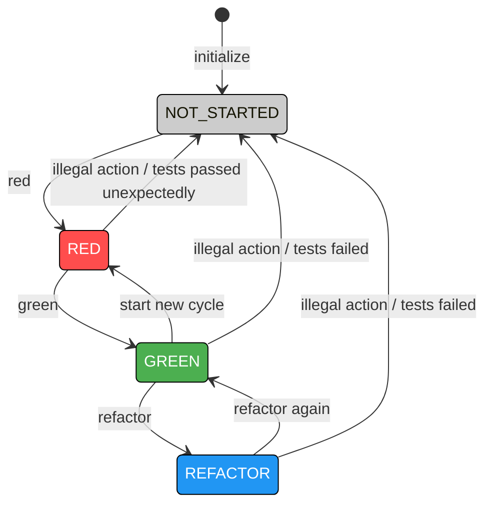

# 🧠 TCRDD — Test, Commit, Revert Driven Development

**TCRDD** is a Bash tool that extends Git with two new command line tools: `git-tdd` and `git-bet`.  
It automates the *Test → Commit → Revert* workflow, helping you code with higher discipline and safety.

There are **two modes** for this tool (Read the section below for detailled informations): 
- **git tdd**
This mode is the recommended one, and is intended to follow the TDD philosophy.
`Write a failing test` > `then type red` > `Make it pass` > `then type green` > `refactor as you want` > `then type refactor` > `... and iterate`
- **git bet**
This mode is the legacy one, but is kept as it can be useful in some coding dojos.
In this mode you can bet a test should pass `git-bet pass ./npm run test` or fail `git-bet fail ./npm run test`
You can also put in place a background timer that will perform `pass` each \<n\> minutes `git-bet timer 2 ./npm run test`


This tool is inspired from : 
- practices used in the [Dojo Developpement Paris Meetup](https://www.meetup.com/dojo-developpement-paris/)
- The [git-gamble](https://gitlab.com/pinage404/git-gamble) TCRDD Rust tool

I do personnaly prefer using bash scripts as developpement tooling, in standard bash with as low footprint as possible.

Thanks to the [Dojo Developpement Paris Meetup](https://www.meetup.com/dojo-developpement-paris/) and to [Pinage404](https://gitlab.com/pinage404) for the inspiration.

---

## 🚀 Features for the git-tdd tool



The idea is to enforce the use of red > green > refactor in this sequence.
1. You have to create a failing test (RED)
2. You have to make it pass (GREEN)
3. You can refactor your code as you need (REFACTOR)
4. ... then you iterate again in this same order

Each time you perform an illegal action, you code is reverted and you start the loop again

### 🎯 Core commands

| Command | Description | Example |
|----------|-------------|--------|
| `configure <test commands>` | You have to first configure the tdd tool once by giving it the test commands to run for testing. <br/> You can call this command at any time to replace the existing configuration. | `configure ./gradlew test` <br/> or <br/> `configure ./npm run test`
| `red` | You have to begin by red. <br/>It expects failure — if tests unexpectedly pass, revert code. Otherwise, do nothing. | `red`
| `green` | Once in red phase, You have to make your tests pass — if they pass, changes are automatically committed. If they fail, revert code. | `green`
| `refactor` | Once green you can refactor as long as you need but as long as all tests still pass. |`refactor`|
| `state` | Returns the current state you are in (NOT STARTED, RED or GREEN), and the test commands configuration.  |`state`|
| `collapse` | Interactively squash a chosen number of recent commits into one. |`collapse`|

---

## 💡 Aliases

| Alias | Expands to | Description |
|--------|-------------|-------------|
| `configure` | `git-tdd configure` | Configure the tdd tool pass passing it the test commands to execute each time |
| `red` | `git-tdd red` | Execute the red check |
| `green` | `git-tdd green` | Execute the green check |
| `refactor` | `git-tdd refactor` | Execute the refactor check |
| `state` | `git-tdd state` | Shows the current phase state and configuration |
| `collapse` | `git-tdd collapse` | Collapse last commits interactively |
---

## 🚀 Features for the git-bet tool

### 🎯 Core commands

| Command | Description | Example |
|----------|-------------|--------|
| `git-bet pass <command>` | Run tests — if they pass, automatically commit changes. If they fail, revert code. | `git-bet pass npm test` <br/> `gbp ./gradlew test`
| `git-bet fail <command>` | Expect failure — if tests unexpectedly pass, revert code. Otherwise, do nothing. |`git-bet fail npm test` <br/> `gbf ./gradlew test`|
| `git-bet timer <minutes> <command>` | Run `git-bet pass` every _N_ minutes automatically in the background. |`gbt 3 npm test`|
| `git-bet timer 0` | Stop the background timer and log tail. |`gbt 0`|
| `git-bet collapse` | Interactively squash a chosen number of recent commits into one. |`gbc`|

---

## 💡 Aliases

| Alias | Expands to | Description |
|--------|-------------|-------------|
| `gbp` | `git-bet pass` | Bet that tests will pass |
| `gbf` | `git-bet fail` | Bet that tests will fail |
| `gbt` | `git-bet timer` | Start or stop the timed auto-run |
| `gbc` | `git-bet collapse` | Collapse last commits interactively |

---

## ⚙️ Installation

1. Clone this repository:

   ```bash
   git clone https://github.com/ymedaghri/tcrdd.git
   ```

2. Copy the content of gittdd.sh into your ~/.zshrc or ~/.bash_profile or ~/.bashrc for the git-tdd tool
    
3. Copy the content of gitbet.sh into your ~/.zshrc or ~/.bash_profile or ~/.bashrc for the git-tdd tool

4. You can also simply source them (if you don't want to copy their content) from within your ~/.zshrc or ~/.bash_profile or ~/.bashrc

5. Reload your shell :

    ```bash
        source ~/.bash_profile
    ```
    or
    ```bash
        source ~/.zshrc
    ```
    or
    ```bash
        source ~/.bashrc
    ```
6. Check git-tdd
    ```bash
        type git-tdd
        type red
        type green
        type refactor
        type collapse
        type configure
        type state
    ```

7. Or Check git-bet
    ```bash
        type git-bet
        type gbp
        type gbf
        type gbc
        type gbt
    ```

### Platform compatibility

`TCRDD` uses standard Bash and Git commands, so it should run on any system with:
- Bash ≥ 4.0
- Git installed

It has been tested successfully on:

- **macOS (default zsh with Bash compatibility)**
- **Debian Bullseye Slim (via Node 20 Docker image)**

These environments cover most Linux and Unix-like systems.  
Other distros (Ubuntu, Fedora, Arch, etc.) are expected to behave identically.

Here is the test procedure if needed.

- Debian Bullseye slim
    ```bash
        docker run -it --rm \
        -v "$PWD/tcrdd.sh":/home/tcrdd/tcrdd.sh \
        -v "$PWD/test-platforms":/home/tcrdd/test-platforms \
         -w /home/tcrdd \
        node:20-bullseye-slim \
        bash -c "apt-get update && apt-get install -y git && bash -l"
        
        source tcrdd.sh
        git config --global user.email "you@example.com"
        git config --global user.name "Your Name"
        cd test-platforms
        git init        
        npm i
        gbp npm test
    ```

- Alpine BusyBox
    ```bash
        docker run -it --rm \
        -v "$PWD/tcrdd.sh":/home/tcrdd/tcrdd.sh \
        -v "$PWD/test-platforms":/home/tcrdd/test-platforms \
        -w /home/tcrdd \
        alpine \
        sh -c "apk add --no-cache bash git nodejs npm && exec bash"

        source tcrdd.sh
        git config --global user.email "you@example.com"
        git config --global user.name "Your Name"
        cd test-platforms
        git init
        npm i
        gbp npm test
    ```
